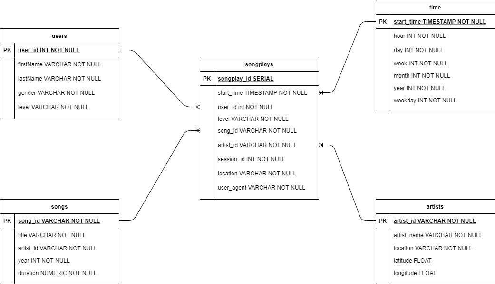

# PROJECT: Data Modeling with Postgres

## Overview

A startup called Sparkify wants to analyze the data they've been collecting on songs and user activity on their new music streaming app. The analytics team is particularly interested in understanding what songs users are listening to. Currently, they don't have an easy way to query their data, which resides in a directory of JSON logs on user activity on the app, as well as a directory with JSON metadata on the songs in their app. So to meet their demands, a Postgres database with tables designed will be created to optimize queries on song play analysis.

## Running pipeline guidline
- Prerequisites:
    - Install python 3 and postgreSQL.
    - Create virtual environment (venv) and use requirements.txt to install dependencies in command line:
    
        - $ python -m venv venv    
        - $ pip install -r requirements.txt

- Run the pipeline by command line:
    - Step 1: Create Database and table in postgreSQL
        - $ python create_tables.py 
    - Step 2: Run the pipeline (procees and load data to the database)
        - $ python etl.py

## About the Dataset

There are 2 datasets: Song and Log (which collecting user activities) in the directories "/data/song_data/" and "/data/log_data/".

1. Song Dataset:

The first dataset is a subset of real data from the Million Song Dataset. Each file is in JSON format and contains metadata about a song and the artist of that song. The files are partitioned by the first three letters of each song's track ID. 

Example of file path to two files in this dataset:

- song_data/A/B/C/TRABCEI128F424C983.json
- song_data/A/A/B/TRAABJL12903CDCF1A.json

And below is an example of what a single song file, TRAABJL12903CDCF1A.json, looks like.

{
    "num_songs": 1, 
    "artist_id": "ARJIE2Y1187B994AB7", 
    "artist_latitude": null, 
    "artist_longitude": null, 
    "artist_location": "", 
    "artist_name": "Line Renaud", 
    "song_id": "SOUPIRU12A6D4FA1E1", 
    "title": "Der Kleine Dompfaff", 
    "duration": 152.92036, 
    "year": 0
}

2. Log Dataset

The second dataset consists of log files in JSON format generated by this event simulator based on the songs in the dataset above. These simulate activity logs from a music streaming app based on specified configurations.

The log files  are partitioned by year and month. For example, here are filepaths to two files in this dataset.

- log_data/2018/11/2018-11-12-events.json
- log_data/2018/11/2018-11-13-events.json

And below is an example of what the data in a log file, 2018-11-12-events.json, looks like.

## About files in the repository

- create_tables.py: create tables.
- etl.py: reads and processes files from song_data and log_data and load thems into tables.
- sql_querries.py: contains all sql querries, and is imported into two files above.

## Schema
The sparkify database schema is a star design. The schema has one fact table (songplays) and four dimension tables (songs, users, artists, and time).

The schema of the DB is as follow:

